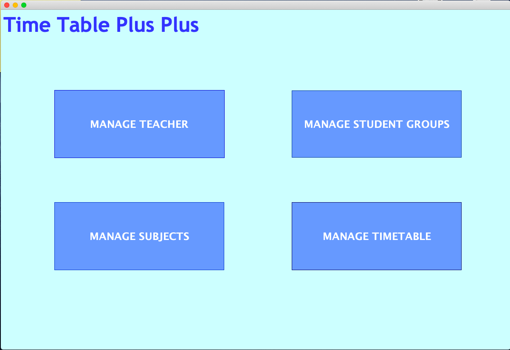
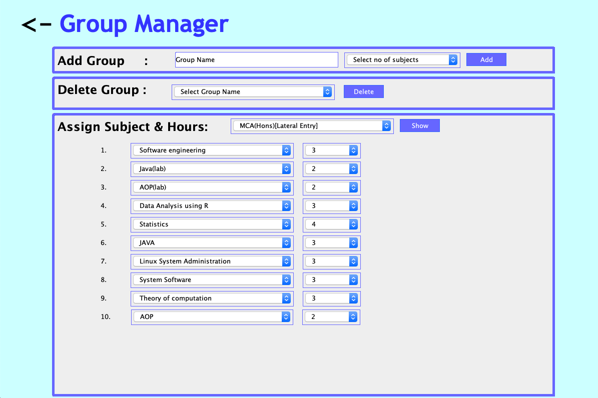
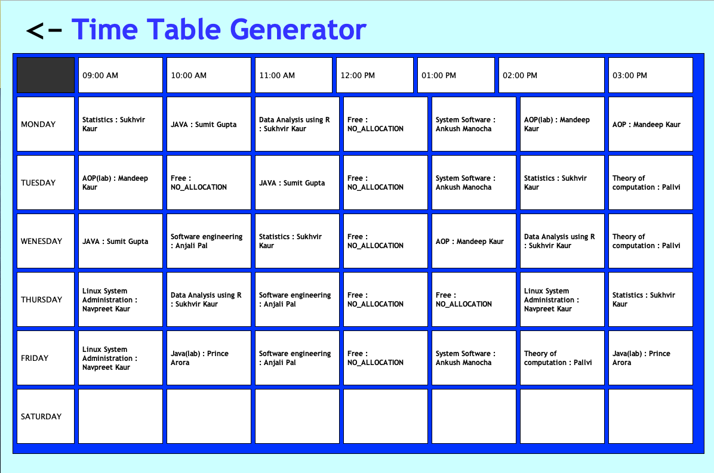

# AUTOMATIC-TIMETABLE-GENERATOR - College Timetable Management System



## Overview
AUTOMATIC-TIMETABLE-GENERATOR is a Java-based timetable management system designed for educational institutions to efficiently manage and generate class schedules. The system provides automated timetable generation with conflict detection.

## Key Features
- **Automated Timetable Generation**: AI-powered scheduling algorithm
- **Teacher Management**: Add/edit/remove teacher records
- **Subject Management**: Manage course subjects  
- **Student Group Management**: Organize student groups
- **Conflict Detection**: Prevents scheduling conflicts
- **Database Integration**: MySQL database support
- **User-Friendly GUI**: Swing-based interface

## System Requirements
- Java 8+
- MySQL 5.7+
- Maven (for building)

## Installation
1. Clone the repository
2. Import `db.sql` to MySQL
3. Update database credentials in `DatabaseConnection.java`
4. Build with Maven:
```bash
mvn clean package
```
5. Run:
```bash
java -jar target/TimeTable-1.0-SNAPSHOT.jar
```

## Usage Guide
1. Launch the application
2. Use the main menu to:
   - Manage Teachers/Subjects/Groups
   - Generate Timetables
   - View/Edit Schedules

## Screenshots



## Project Structure
```
src/
└── main/
    └── java/com/javamini/timetable/
        ├── TimeTableGenerator.java    # Core algorithm
        ├── DatabaseConnection.java    # DB operations
        ├── MainMenu.java              # Main UI
        └── ...                        # Management modules
```

## Contributors
- Yogesh 
- Priya 
- Raghul 

